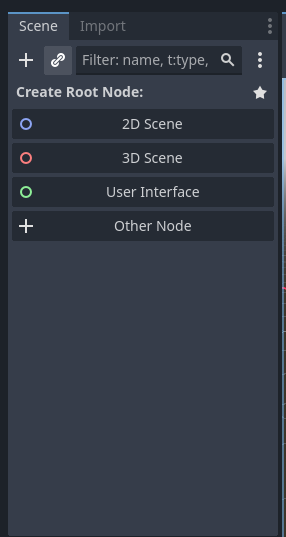
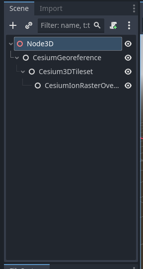
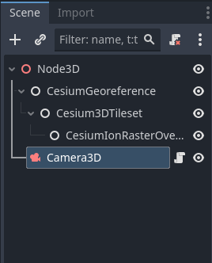
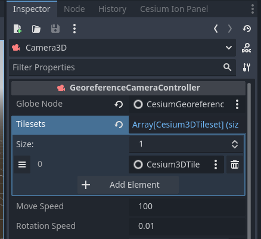

# 3D Tiles for Godot

A Godot 4 extension that integrates Cesium 3D Tiles capabilities into Godot Engine through GDExtension.

## 3D Tiles and the 3D Geospatial Ecosystem
3D Tiles for Godot streams real-world 3D content such as high-resolution photogrammetry, terrain, imagery, and 3D buildings from Cesium Ion and other sources available as optional commercial subscriptions. The plugin includes Cesium Ion integration for instant access to global high-resolution 3D content ready for runtime streaming. Cesium ion users can also leverage cloud-based 3D tiling pipelines to create end-to-end workflows to transform massive heterogenous content into semantically-rich 3D Tiles, ready for streaming to the Godot Engine.

3D Tiles for Godot supports cloud and private network content and services based on open standards and APIs. You are free to use any combination of supported content sources, standards, APIs with 3D Tiles for Godot.

## Godot Engine Integration
3D Tiles for Godot is tightly integrated with the Godot Engine making it possible to visualize and interact with real-world content in editor and at runtime. The plugin also has support for Godot physics, collisions, and character interaction. Leverage decades worth of cutting-edge advancements from the 3D Tiles standard to create cohesive, interactive, and realistic simulations and applications.


## Prerequisites

- **C++ 20**
- **CMake 3.1+**
- **Python 3.8+** (with pip)
- **SCons** (`pip install scons`)
- **Visual Studio 2022** with C++ desktop development workload (If you plan on contributing or developing)
- **Git**
- **Godot 4.1+** (with GDExtension support)
- **Windows 10/11** (64-bit)

## Installation (as GDExtension)

### 1. Clone the Repository
```bash
git clone https://github.com/Battle-Road/3D-Tiles-For-Godot.git
cd 3D-Tiles-For-Godot
```

If you would like to build the binaries and you don't plan on modifying the underlying C++ code with any editor use the following command
`scons platform=windows arch=x64 compileTarget=extension`

Otherwise, to get a `compile_commands.json` file to use with an IDE or Text Editor, run
`scons platform=windows compiledb=true arch=x64 compileTarget=extension debug_symbols=true`

#### Build Flags Explained:

* `platform=windows`: Build for Windows (currently only supported platform)

* `compiledb=true`: Generate IDE-friendly compilation database (optional)

* `arch=x64`: 64-bit architecture, will be used as build architecture for all subsequent libraries 

* `compileTarget=extension`: Build as GDExtension

* `debug_symbols=yes`: Include debug information (use no for release)

**The build binaries will be at `godot3dtiles/bin/Godot3DTiles.windows.template_debug.x86_64.dll`**


## Setting Up a Project
### Create New Godot Project

* Use Godot 4.1 or newer

* Choose "Forward+" renderer in project settings

### Copy Plugin Files

* From the repository:

  * Copy `godot3dtiles/bin/` folder to your project root

  * Copy `godot3dtiles/addons/` folder to your project root

Your project structure should look like:

```
my_project/
├── addons/
│   └── cesium_godot/
│       ├── panels/
│       ├── scripts/
│       └── visuals/
├── bin/
└── project.godot
```

Alternatively, you can choose to create a new project using the `godot3dtiles/` folder as the project's root

### Enable the plugin

* Open your project in Godot

* Go to Project → Project Settings → Plugins

* Enable "cesium_godot"

## Getting Started

### Using the Cesium Ion Panel


The Cesium Ion Panel provides essential tools for managing geospatial content and configuring plugin integration with Cesium services.

**Connect to Cesium ION**


* Select Connect to Cesium ION to connect the plugin to your Cesium account.

* Requires valid Cesium ION credentials

* Grants access to your private assets and token-protected resources

* Maintains session security through OAuth2 authorization flow.

### Setting up your first scene

**Create a new 3D scene**


**Add a new tileset**
You can choose between the different pre-defined tilesets provided to you on the Cesium Ion Panel, or create a new blank tileset to customize it with your desired asset id and data source URL.

You should now see multiple nodes were added to your scene, depending on the option you picked.

*Example with pre-defined tileset Cesium World Terrain + Bing Maps Aerial Imagery*


**Add a dynamic camera**

Back to the Cesium Panel, you should now be able to click on the dynamic camera button and see it get added to your scene.



You should also see the tilesets and CesiumGeoreference have been added automatically to the camera's properties in the inspector.



**Hit the Play button**
Tiles should start loading in now!

#### Note: This plugin is currently Windows-only. Linux/MacOS support is planned for future releases.

